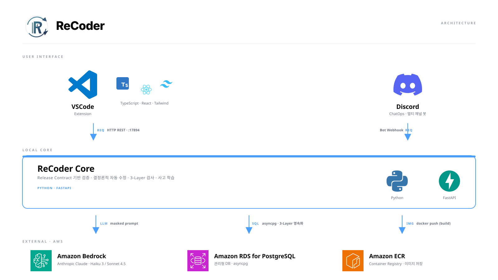

# ReCoder

> **AI DevOps Agent for VSCode** — 코드 수정부터 컨테이너 배포까지, 결정론적·감사 가능한 흐름으로 자동화.

ReCoder 는 개발자가 VSCode 사이드바에서 "분석" 또는 "배포" 한 번만 누르면, AI 가 코드 에러를 분석해 패치를 제안하고, **Release Contract** 기반으로 12가지 정적 검사를 수행한 뒤, 임시 컨테이너로 실제 동작을 검증한 다음 안전하게 배포합니다. 같은 사고가 재발하면 과거 해결책을 자동으로 떠올리는 **IncidentMemory** 도 내장.

---

## 핵심 컨셉

| 개념 | 설명 |
|------|------|
| **Release Contract** (`recoder.yml`) | 프로젝트의 배포 계약 — 스택, 포트, health 경로, 필수 환경 변수, 자동 롤백 트리거 등을 명시. First Run Wizard 가 5개 질문으로 자동 생성. |
| **Static Preflight** | 배포 전 12가지 정적 검사 (env, code, Dockerfile, 포트, 의존성, secret leak). 결과를 0~100 점수와 BLOCKED/WARN/PASSED 상태로 종합. |
| **Runtime Preflight** | 임시 docker 컨테이너 띄워서 health probe + smoke tests + 컨테이너 로그 패턴 검사. 자동 정리 (try/finally). |
| **Deterministic Remediation** | 같은 입력 → 같은 `proposal_id` (SHA256). LLM 직접 코드 생성 대신 **결정론적 템플릿 치환** 으로 재현성 보장. |
| **3-Layer Audit** | `PreflightRun` → `RemediationRun` → `DeploymentLedger` 의 SQLite 영속화. Layer 3 는 append-only + 4-state 상태머신. |
| **IncidentMemory** | 사고 fingerprint (마스킹 후 SHA256) 기반 매칭. 같은 사고 재발 시 과거 해결책 자동 제안. 옵트인 학습. |
| **Continuous Verification** | 배포 후 5분 감시 — health 실패율, 분당 에러 로그율, 메모리 사용률 추적 → 자동 롤백 제안. |
| **Safety CI Gate** | 6 카테고리 (Preflight 정확도, 결정성, 적용성, fingerprint, 매칭, **보안 회귀**) 자동 평가. 보안 회귀 1건이라도 발견 시 머지 차단. |
| **Multi-channel** | VSCode + Discord ChatOps (`/recoder deploy`, `/recoder rollback` 등) 양쪽 지원. |

---

## 아키텍처



VSCode 와 Discord 두 채널이 Local Core (Python · FastAPI) 를 통해 Amazon Bedrock (Claude) / RDS for PostgreSQL / ECR 과 연동되는 솔루션 아키텍처입니다. Core 는 Release Contract 기반 검증 · 결정론적 자동 수정 · 3-Layer 감사 · 사고 학습 4가지 책임을 가집니다.

---

## 빠른 시작

### 사전 요구사항
- Python 3.11+
- Node.js 20+
- Docker Desktop (배포 흐름 사용 시)
- AWS Bedrock 자격 (Claude Haiku 3 / Sonnet 사용 시)

### Core 서버

```bash
cd core
python -m venv .venv
.venv\Scripts\Activate.ps1          # Windows
# source .venv/bin/activate         # macOS/Linux
pip install -r requirements.txt
python main.py
# → http://127.0.0.1:17894
```

### VSCode Extension

```bash
cd extension
npm install
npm run compile
# VSCode 에서 F5 (Extension Development Host)
```

확장이 켜지면 사이드바에 ReCoder 아이콘 표시 → 카드 UI 등장.

### `.env` 설정 예시 (`core/.env`)

```env
# AWS Bedrock
AWS_REGION=ap-northeast-2
BEDROCK_PRIMARY_MODEL_IDENTIFIER=anthropic.claude-3-haiku-20240307-v1:0
BEDROCK_SECONDARY_MODEL_IDENTIFIER=apac.anthropic.claude-sonnet-4-5-20251022-v1:0
BEDROCK_FAST_MODEL_IDENTIFIER=anthropic.claude-3-haiku-20240307-v1:0

# Quality 임계
RECODER_QUALITY_MIN=0.4
RECODER_QUALITY_WARN=0.6
RECODER_TRIGGER_THRESHOLD=0.5
```

AWS 자격은 `~/.aws/credentials` 의 default 프로파일 또는 IAM Role 에서 자동 로드.

---

## 사용 흐름

1. **첫 실행**: First Run Wizard 가 Docker / AWS / Bedrock 연결 진단 후, 프로젝트를 스캔해 `recoder.yml` 을 5개 질문으로 자동 생성.
2. **에러 분석**: 터미널 에러 감지 또는 사이드바 "에러 분석" 클릭 → Bedrock 호출 → `PatchProposal` 카드 표시 → 사용자 승인 후 적용.
3. **배포 검증**:
   - **Static Preflight** 12 검사 → blocker / warning 카드 표시
   - blocker 가 있으면 **RemediationProposal** 자동 제안 (DIFF / FILE_CONTENT / COMMAND / GUIDANCE 4가지 preview)
   - 사용자 승인 후 적용 → 재검사 → 통과 시 다음 단계
4. **Runtime Preflight**: 임시 컨테이너 띄워 health + smoke 검증.
5. **배포 + CV**: docker run → 5분간 health/error/memory 감시 → STABLE / WARNING / AUTO_ROLLBACK_PROPOSED.
6. **IncidentMemory**: 사고 발생 시 fingerprint 매칭 → 과거 fix 즉시 제안 (옵트인 학습).

---

## 개발

### 테스트

```bash
cd core
$env:PYTHONPATH = "."
python -m pytest tests/unit/ -v        # 225 단위 테스트
python -m eval.v10                     # v10 백본 자동 평가 (Safety Gate)
```

`python -m eval.v10` 은 exit code 로 CI 통합 가능 (0 = pass, 1 = fail).

### 디렉토리 구조

```
Re-Coder/
├─ core/                         # Python FastAPI Core
│  ├─ preflight/                 # Static + Runtime Preflight
│  │   ├─ checks/                #   12 검사 모듈
│  │   ├─ static.py              #   StaticPreflightRunner (ThreadPool)
│  │   └─ runtime.py             #   RuntimePreflightRunner (docker)
│  ├─ remediation/               # 결정론적 수정 제안
│  │   ├─ registry.py            #   FileTemplate / CommandTemplate
│  │   ├─ generator.py           #   12 blocker 별 generator
│  │   └─ applier.py             #   DIFF / FILE_CONTENT / COMMAND / GUIDANCE
│  ├─ cv/                        # Continuous Verification
│  │   ├─ monitor.py             #   5분 폴링
│  │   └─ triggers.py            #   auto-rollback 평가
│  ├─ persistence/               # 3-Layer SQLite
│  │   ├─ preflight_store.py     #   Layer 1
│  │   ├─ remediation_store.py   #   Layer 2
│  │   └─ ledger_store.py        #   Layer 3 (append-only)
│  ├─ incident_memory/           # 사고 학습
│  │   ├─ fingerprint.py         #   SHA256 시그니처 + 마스킹
│  │   ├─ memory_store.py        #   SQLite 저장소
│  │   ├─ learner.py             #   옵트인 학습
│  │   └─ matcher.py             #   exact + cross-project 매칭
│  ├─ eval/v10/                  # 자동 평가 + Safety Gate
│  │   ├─ runner.py              #   6 카테고리 평가
│  │   └─ gate.py                #   CI gate (exit code)
│  ├─ api/routes/                # FastAPI 라우트
│  ├─ schemas.py                 # Pydantic 데이터 모델 (178+)
│  ├─ context_gate.py            # 16-pattern secret 마스킹
│  ├─ orchestrator.py            # FSM (17 상태)
│  └─ tests/unit/                # 225 단위 테스트
├─ extension/                    # VSCode Extension (TS)
│  ├─ src/                       #   확장 진입점 + API 클라이언트
│  └─ webview-src/               #   React + Tailwind UI
└─ docs/                         # 가이드
```

---

## 핵심 설계 원칙

1. **결정론적 자동 수정** — 같은 입력 → 같은 `proposal_id`. LLM 비결정성 영향 차단. 감사 가능, 캐시 가능.
2. **Secret 절대 비노출** — 16-pattern Context Gate 가 LLM 호출 전 마스킹. `mask_for_fingerprint` 가 로그/메시지에도 적용. AWS / GitHub / OpenAI / Stripe / Slack 토큰 자동 제거.
3. **Append-only 감사** — `DeploymentLedger` 는 INSERT only + 4-state 머신 (DEPLOYING → STABLE / FAILED / ROLLED_BACK).
4. **Safety Gate** — CI 단계에서 보안 회귀 1건이라도 발견 시 머지 차단. `python -m eval.v10` → exit 1.
5. **옵트인 학습** — `IncidentMemory` 는 `user_consent=True` 일 때만 저장. GDPR 호환 `delete_incident_memory` 지원.

---

## 진척 상황

| 단계 | 내용 | 상태 |
|------|------|------|
| **Phase A-1** | v10 데이터 모델 178+ | 완료 |
| **Phase A-2** | Static Preflight 12 검사 (43 tests) | 완료 |
| **Phase A-3** | Deterministic Remediation (49 tests) | 완료 |
| **Phase A-4** | 3-Layer SQLite (30 tests) | 완료 |
| **Phase A-5** | IncidentMemory (27 tests) | 완료 |
| **Phase A-6** | Eval Harness + Safety Gate (14 + 28 cases) | 완료 |
| **Phase B-1** | Runtime Preflight (34 tests) | 완료 |
| **Phase B-2** | Continuous Verification (28 tests) | 완료 |
| Phase B-3 | EC2 SSH + Watchdog v1 | 2학기 (AWS 셋업 후) |
| Phase B-4 | Hybrid Cloud Relay (DynamoDB + Lambda) | 2학기 |

총 **225 단위 테스트** + **Eval Gate 6 카테고리 28 케이스** 모두 100% 통과.

---

## 문서

- [docs/MENTOR_DEMO.md](docs/MENTOR_DEMO.md) — 멘토링 데모 가이드 (Backbone + Bedrock E2E)
- [PROGRESS.md](PROGRESS.md) — 누적 진행 사항
- [HANDOFF.md](HANDOFF.md) — 팀 인수인계

---

## 라이선스

내부 학기 프로젝트 — 추후 결정.
