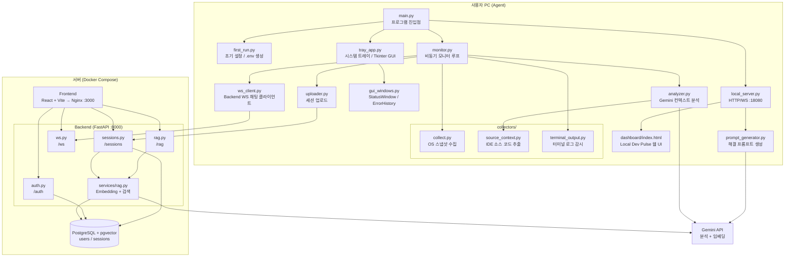
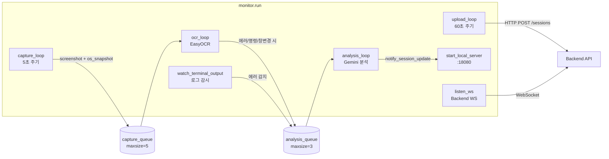
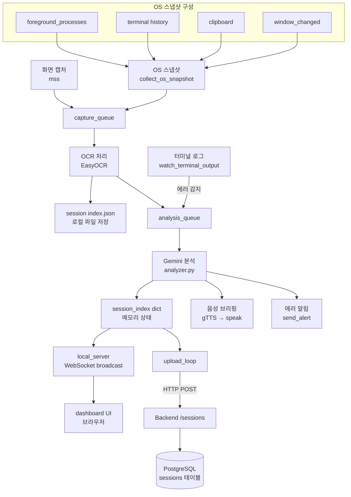
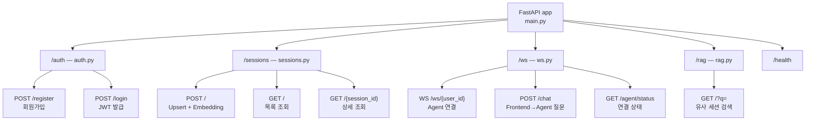
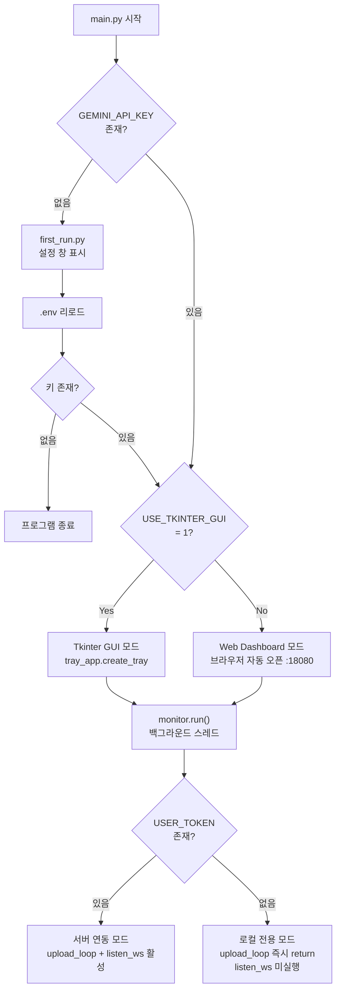
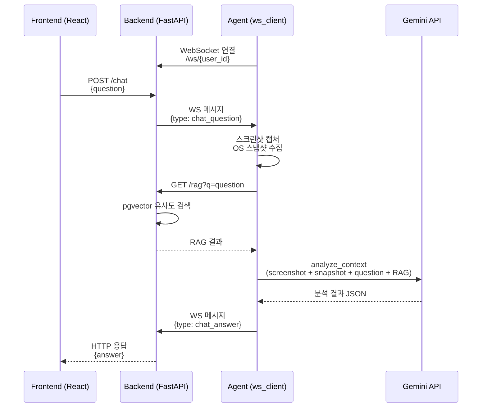
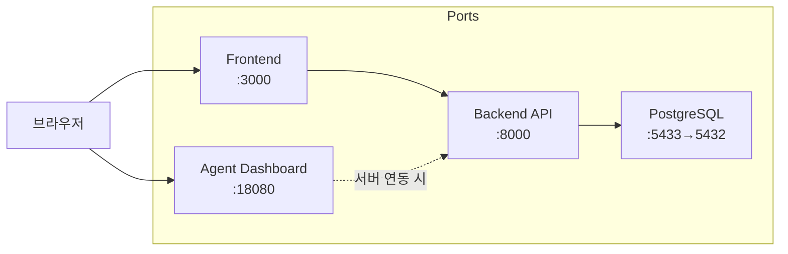

# AI Workspace Assistant — 시스템 아키텍처

## 1. 전체 시스템 구성도



## 2. Agent 비동기 태스크 흐름



## 3. 데이터 흐름 상세



## 4. Backend API 라우팅 구조



## 5. 실행 모드 분기



## 6. 서버 연동 채팅 시퀀스



## 7. 포트 및 서비스 요약



---

# AI Workspace Assistant — 실행 가이드

## 사전 요구 사항

| 항목   | 요구 사항                                                                                       |
| ------ | ----------------------------------------------------------------------------------------------- |
| OS     | macOS 12+ / Windows 10+ / Ubuntu 20.04+                                                         |
| Python | 3.12 (pyenv 권장)                                                                               |
| Docker | Docker Desktop (서버 연동 모드 사용 시)                                                         |
| API 키 | Gemini API 키 —[https://aistudio.google.com/app/apikey](https://aistudio.google.com/app/apikey) |

---

## 1단계: Python 환경 구축

### macOS (pyenv + tcl-tk)

macOS에서 Tkinter GUI를 사용하려면 tcl-tk 9.0과 함께 Python을 빌드해야 합니다.

```bash
brew install pyenv tcl-tk

export LDFLAGS="-L$(brew --prefix tcl-tk)/lib"
export CPPFLAGS="-I$(brew --prefix tcl-tk)/include"
export PKG_CONFIG_PATH="$(brew --prefix tcl-tk)/lib/pkgconfig"
export PYTHON_CONFIGURE_OPTS="--with-tcltk-includes='-I$(brew --prefix tcl-tk)/include' --with-tcltk-libs='-L$(brew --prefix tcl-tk)/lib -ltcl9.0 -ltk9.0'"

pyenv install 3.12.11
```

설치 확인:

```bash
pyenv shell 3.12.11
python -c "import tkinter; print(tkinter.TkVersion)"
```

출력이 `9.0`이면 성공입니다.

### Windows

python.org에서 Python 3.12를 설치하면 tkinter가 기본 포함됩니다. 추가 설정은 필요 없습니다.

---

## 2단계: Agent 의존성 설치

```bash
cd ai-workspace-assistant/agent

pyenv local 3.12.11

python -m venv .venv
source .venv/bin/activate
```

Windows의 경우 활성화 명령:

```powershell
.venv\Scripts\activate
```

의존성 설치:

```bash
pip install --upgrade pip setuptools wheel
pip install -r requirements.txt
```

---

## 3단계: .env 설정

```bash
cp .env.example .env
```

`.env` 파일을 열어 최소한 다음 항목을 설정합니다:

```
GEMINI_API_KEY=여기에_실제_키_입력
GEMINI_MODEL=gemini-2.0-flash-lite
EMBEDDING_MODEL=gemini-embedding-001
```

> .env 파일 없이 `python main.py`를 실행하면 자동으로 설정 창이 표시됩니다.

---

## 4단계: macOS 권한 설정

Agent가 화면을 캡처하고 활성 창 정보를 수집하려면 macOS 시스템 권한이 필요합니다.

**시스템 설정 > 개인정보 보호 및 보안**에서 다음 항목에 터미널 또는 IDE를 추가합니다:

| 권한      | 용도                             |
| --------- | -------------------------------- |
| 화면 녹화 | 스크린 캡처 (mss)                |
| 접근성    | 활성 창/앱 정보 조회 (osascript) |

설정 후 터미널을 완전히 종료하고 재시작합니다.

---

## 5단계: 터미널 출력 캡처 설정

Agent가 터미널 에러를 실시간 감지하려면 터미널 출력을 로그 파일로 기록해야 합니다.

### macOS / Linux (zsh)

```bash
mkdir -p ~/.ai_assistant
cat >> ~/.zshrc <<'EOF'
# 터미널 로그 기록 수동 시작 (권장)
logterm() {
    mkdir -p "$HOME/.ai_assistant"
    script -q -a "$HOME/.ai_assistant/terminal.log"
}
EOF

# 현재 셸 반영
source ~/.zshrc

# 로그 기록 시작 (필요할 때만 실행)
logterm
```

`script` 명령을 `~/.zshrc`에서 무조건 실행하도록 추가하면 재귀 셸로 인해 무한 루프가 발생할 수 있습니다. 위처럼 함수만 등록하고 필요할 때 실행하세요.

프로그램 시작 시 자동 캡처를 원하면 Agent의 `.env`에 다음 값을 추가하세요:

```env
AUTO_START_TERMINAL_CAPTURE=1
```

이 옵션은 재귀 실행 방지 가드(`AI_ASSISTANT_SCRIPT_ACTIVE`)를 사용하므로 zsh 무한 루프를 피합니다.

### Windows (PowerShell)

```powershell
mkdir "$env:USERPROFILE\.ai_assistant" -Force
Start-Transcript -Path "$env:USERPROFILE\.ai_assistant\terminal.log" -Append
```

---

## 6단계: Agent 실행

### Web Dashboard 모드 (기본)

```bash
python main.py
```

브라우저에서 `http://127.0.0.1:18080` 대시보드가 자동으로 열립니다.

### Tkinter GUI 모드

```bash
USE_TKINTER_GUI=1 python main.py
```

시스템 트레이 아이콘과 함께 Tkinter 기반 대시보드가 실행됩니다.

---

## 7단계: 서버 연동 모드 (선택)

로컬 전용으로 충분하지만, 세션 기록 보관 및 웹 프론트엔드 채팅, RAG 검색 기능을 사용하려면 서버를 실행합니다.

### 7-1. Docker Compose로 서버 실행

```bash
cd ai-workspace-assistant

cp .env.example .env
```

`.env` 파일을 편집합니다:

```
GEMINI_API_KEY=여기에_실제_키_입력
DB_PASSWORD=postgres
JWT_SECRET=최소_32자_이상의_랜덤_시크릿_문자열
```

서버 실행:

```bash
docker compose up -d
```

실행되는 컨테이너:

| 서비스   | 포트        | 설명                     |
| -------- | ----------- | ------------------------ |
| db       | 5433 → 5432 | PostgreSQL 16 + pgvector |
| backend  | 8000        | FastAPI API 서버         |
| frontend | 3000        | React 웹 프론트엔드      |

### 7-2. Agent에서 서버 연결

Agent의 `.env`에 서버 정보를 추가합니다:

```
API_BASE_URL=http://127.0.0.1:8000
API_WS_URL=ws://127.0.0.1:8000
```

Agent를 실행하면 설정 창에서 회원가입 후 로그인할 수 있습니다. 로그인 성공 시 `USER_TOKEN`과 `USER_ID`가 `.env`에 자동 저장됩니다.

서버 연동 모드에서 추가되는 기능:

| 기능          | 설명                                                          |
| ------------- | ------------------------------------------------------------- |
| 세션 업로드   | 60초마다 AI 요약을 서버에 자동 업로드                         |
| 웹 프론트엔드 | [http://localhost:3000](http://localhost:3000/)에서 세션 조회 |
| Agent 채팅    | 웹에서 Agent에게 실시간 질문                                  |
| RAG 검색      | 과거 세션 임베딩 기반 유사도 검색                             |

---

## 설치 확인 체크리스트

Agent 가상환경에서 다음 명령을 모두 실행합니다:

```bash
python -c "import tkinter; print('tkinter OK')"
python -c "import easyocr; print('easyocr OK')"
python -c "import cv2; print('cv2 OK')"
python -c "import mss; print('mss OK')"
python -c "from google import genai; print('genai OK')"
python -c "import aiohttp; print('aiohttp OK')"
python -c "from PIL import Image; print('Pillow OK')"
python -c "import numpy; print('numpy OK')"
python -c "import pystray; print('pystray OK')"
```

모두 OK가 출력되면 환경이 정상입니다.

---

## 자주 발생하는 문제

### ModuleNotFoundError: No module named ‘\_tkinter’

Python이 tcl-tk 없이 빌드된 경우 발생합니다. 1단계의 환경 변수를 설정한 뒤 `pyenv install 3.12.11`로 재빌드하세요. 웹 대시보드 모드로 실행하면 tkinter가 필요하지 않습니다.

### OpenCV 버전 충돌

easyocr가 `opencv-python-headless`를 자동으로 설치합니다. 수동으로 다른 opencv 패키지를 설치하면 충돌이 발생할 수 있습니다:

```bash
pip uninstall -y opencv-python opencv-contrib-python opencv-python-headless opencv-contrib-python-headless
pip install -r requirements.txt
```

### macOS 화면 캡처 실패 / Trace Trap

시스템 설정에서 화면 녹화 권한을 부여하지 않으면 mss가 동작하지 않습니다. 권한 부여 후 터미널을 완전히 종료하고 재시작하세요.

### EasyOCR 첫 실행 시 느림

첫 실행 시 `~/.EasyOCR/model/` 경로에 약 100MB의 모델 파일을 다운로드합니다. 이후에는 캐시되어 빠르게 시작됩니다.

### Docker Compose DB 연결 실패

PostgreSQL이 완전히 시작되기 전에 backend가 연결을 시도할 수 있습니다:

```bash
docker compose down
docker compose up -d
```

healthcheck 설정이 순서를 보장하므로 재시작하면 해결됩니다.

### zsh 시작 시 터미널 무한 루프

`~/.zshrc`에 `script -q -a ~/.ai_assistant/terminal.log`를 직접 추가하면, 새 셸이 다시 `~/.zshrc`를 읽으면서 반복 실행될 수 있습니다.

복구 방법:

```bash
/bin/zsh -f
sed -i '' '/script -q -a ~\/\.ai_assistant\/terminal.log/d' ~/.zshrc
exec /bin/zsh
```

복구 후에는 5단계의 `logterm` 방식으로 다시 설정하세요.

---

## 포트 요약

| 서비스              | 기본 포트                       | 환경 변수          |
| ------------------- | ------------------------------- | ------------------ |
| Agent 로컬 대시보드 | 18080                           | LOCAL_PORT         |
| Backend API         | 8000                            | docker-compose.yml |
| Frontend            | 3000                            | docker-compose.yml |
| PostgreSQL          | 5433 (호스트) → 5432 (컨테이너) | docker-compose.yml |
